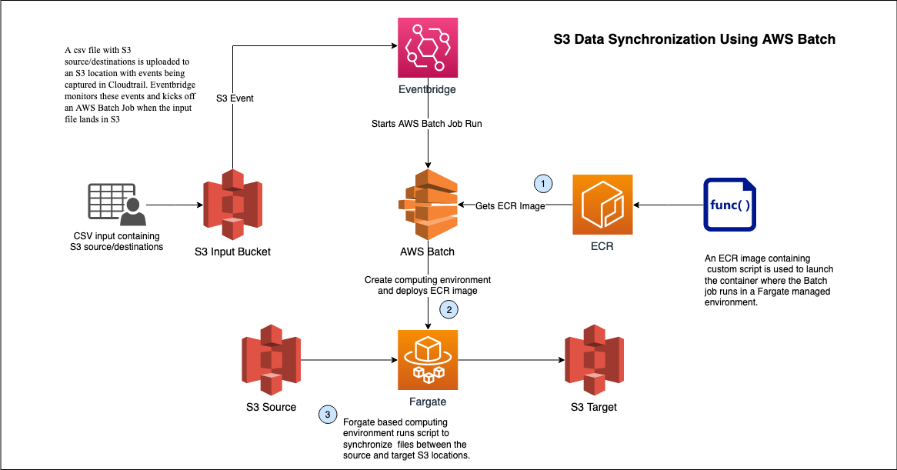
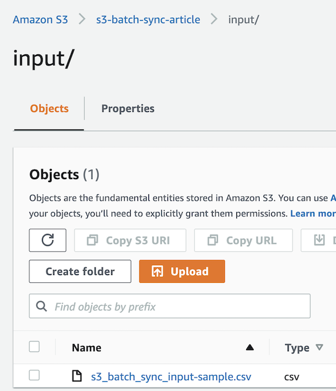
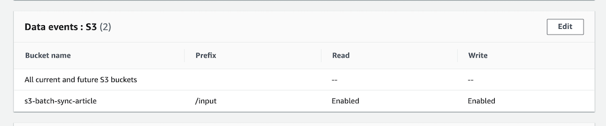
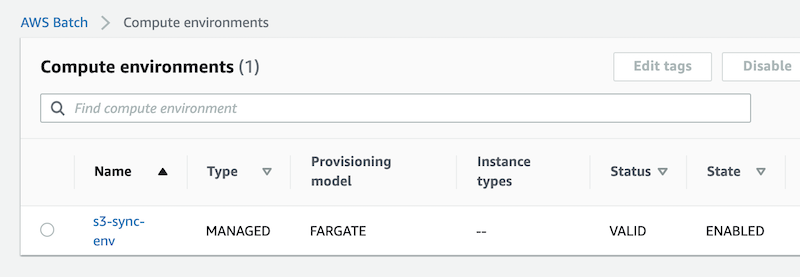
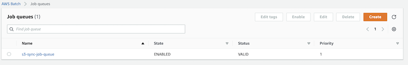
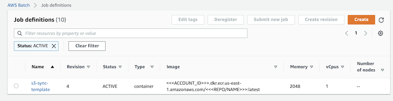

<!-- MarkdownTOC autolink="true" markdown_preview="markdown" -->

- [Using AWS Batch jobs to bulk copy/sync files in S3](#using-aws-batch-jobs-to-bulk-copysync-files-in-s3)
    - [Use Cases](#use-cases)
    - [Overview](#overview)
    - [Architecture](#architecture)
    - [ECR Image](#ecr-image)
    - [S3 Input Location](#s3-input-location)
        - [CSV File Format Details](#csv-file-format-details)
    - [Cloudtrail Monitoring](#cloudtrail-monitoring)
    - [AWS Batch](#aws-batch)
        - [Compute Environment](#compute-environment)
        - [Job Queue](#job-queue)
        - [Job Definition](#job-definition)
            - [IAM Roles](#iam-roles)
    - [Eventbridge Rule & Job Invokation](#eventbridge-rule-job-invokation)

<!-- /MarkdownTOC -->


# Using AWS Batch jobs to bulk copy/sync files in S3

## Use Cases
This utility is aimed towards technical teams who are looking for a scaleable way to copy/sync files within S3. In certain cases, teams may want to replicate certin "prod" data into "dev" to have more robust development environments. Teams may also look to transfer data to other buckets to share with external teams or publically. In both scenarios, having control over what data is copied/syned becomes paramount to ensure sensitive data does not make its way to an environment that could cause security concerns. 

An existing solution is [S3 replication](https://docs.aws.amazon.com/AmazonS3/latest/userguide/replication.html), but that comes with certain limitations. Managing replication rules with multiple directories can get cumbersome, the same prefix must be kept, source and destination must be different buckets, and already existing data cannot be backfilled using replication. As workarounds, teams have managed environments to run custom scripts using AWS SDK to overcome such roadblocks.


## Overview
This guide details how to use [AWS Batch](https://aws.amazon.com/batch/) to perform bulk copy/sync activities on files in [S3](https://aws.amazon.com/s3/). Batch allows users to run massively scalable computing jobs on AWS by provisioning the optimal compute resources needed. The user is able to focus on configuring what the job should be doing instead of provisioning infrastructure.

Here we use Batch's [Managed Compute environment](https://docs.aws.amazon.com/batch/latest/userguide/compute_environments.html#managed_compute_environments) with the [Fargate provioning model](https://docs.aws.amazon.com/batch/latest/userguide/fargate.html), where Batch runs containers without the user having to manage the underlying EC2 instances. We will package our application within an [ECR](https://aws.amazon.com/ecr/) container image that Fargate will use to launch the environment where the job runs.

With Batch configured, the user will upload a .csv file in an S3 location that has it's events being logged in [Cloudtrail](https://aws.amazon.com/cloudtrail/). This is being monitored by [Eventbridge](https://aws.amazon.com/eventbridge/) which will kick off the Batch job once the appropriate file is uploaded. The .csv file contains a list of S3 source/destination pairs to be copied/synced in the job as detailed below. For accessing S3 resources in different AWS accounts, be sure to look at the [IAM Roles section below](#iam-roles)

## Architecture
This is an overview of the architecture described above:  




## ECR Image
The ECR Image contains our application logic to sync/copy S3 files based on the csv input. This is done in the python script `s3CopySyncScript.py`. Based on the CSV input, it will perform a [managed transfer using the copy api](https://boto3.amazonaws.com/v1/documentation/api/latest/reference/services/s3.html#S3.Client.copy) if a file is given as a source/destination. If a prefix is given as source/destination, it will use the [AWS CLI to perform an aws s3 sync](https://docs.aws.amazon.com/cli/latest/reference/s3/sync.html).

The `Dockerfile` builds an image based on [AL2](https://hub.docker.com/_/amazonlinux), installing the AWS cli, python3, boto3, and setting other s3 configuration for optimal transfers.

Create an ECR repository and use these commands to build and push the image as latest using the CLI.

```
aws ecr get-login-password --region us-east-1 | docker login --username AWS --password-stdin <<<ACCOUNT_ID>>>.dkr.ecr.us-east-1.amazonaws.com

docker build -t <<<REPO/NAME>>> .

docker tag <<<REPO/NAME>>>:latest <<<ACCOUNT_ID>>>.dkr.ecr.us-east-1.amazonaws.com/<<<REPO/NAME>>>:latest

docker push <<<ACCOUNT_ID>>>.dkr.ecr.us-east-1.amazonaws.com/<<<REPO/NAME>>>:latest
```

## S3 Input Location
The `.csv file` will be uploaded to s3 to kick off the job. Designate an area for this. In this example, I've created a sample bucket with the prefix `input` and will be uploading files here. Notice also the uploaded csv is prefixed as such: `s3_batch_sync_input-*.csv`. Using a naming convention like this can simplify eventbridge monitoring which we'll see below.



### CSV File Format Details
The csv file should be formatted as such.

| source                                          | destination                              |
|-------------------------------------------------|------------------------------------------|
| s3://some-bucket/source/                        | s3://some-bucket/dest/                   |
| s3://some-bucket/sourcetwo/                     | s3://some-bucket/desttwo/                |
| s3://some-bucket/sourceindiv/individualFile.txt | s3://some-bucket/dest/individualFile.txt |

The first 2 rows in this example are prefixes where we want an s3 sync to occur. The last row is a specific object we want to copy directly. The bucket/AWS account does not need to be the same, as long as IAM permissions are [properly applied as noted below](#iam-roles).

## Cloudtrail Monitoring
Setup a trail that will monitor the S3 location where the input file will land. In setting up the trail you can set these options as you see fit: name, an s3 location for the logs, log encryption using KMS, log validation. You will need to make sure that S3 data events for the location where the input file lands is enabled at a minimum:




## AWS Batch

### Compute Environment 
This will serve as a pool that our batch jobs can pull resources from. Create a `managed environment` with the instance configuration set to `fargate` for this example. Set the max vCPUs to set an upper limit for concurrent fargate resources being used. Other configuration options for an AWS Batch [Compute Environment are detailed here](https://docs.aws.amazon.com/batch/latest/userguide/create-compute-environment.html).
Lastly pick the VPC and subnets your environment will be located in, and security groups that may need to be attached to instances. If you're using S3 VPC gateway endpoints this would be key. In our example, we're using the default VPC since we're accessing S3 through public internet.
Once complete, the environment state would be `ENABLED`.  




### Job Queue
AWS Batch Jobs are submitted to a job queue until compute environment resources are available for the job to run. You can have multiple queues with different priorities which pull from different compute environments. [More details are here](https://docs.aws.amazon.com/batch/latest/userguide/job_queues.html).
For this example, create a queue and attach it to the compute environment previously made.



### Job Definition
The Job Definition acts as a template from which to launch our individual jobs. [Detailed instructions are here for additional configuration](https://docs.aws.amazon.com/batch/latest/userguide/create-job-definition.html).

* **Basics**  
    - Enter a `name` for the template and pick `fargate` for the platform.
    - Depending on your anticipated use, set a `retry strategy` and `timeout`. For this example we set 2 job attempts and a timeout of 120 seconds.
    - We'll also put job logs in the default AWS Batch logs group in cloudwatch but it [can be customized as detailed here](https://docs.aws.amazon.com/batch/latest/userguide/using_awslogs.html).

* **Python Script Usage**
    - Note the usage of the script described here and then set the container properties in the next step as required
    - Syntax: `python s3CopySyncScript.py <<bucket containing input .csv file>> <<key of input .csv file>> <<header True/False>> <<sync_delete True/False>>`
        + *header* indicates whether the input csv has a header row
        + *sync_delete* indicates whether the [--delete flag is used in case of an aws s3 sync]((https://docs.aws.amazon.com/cli/latest/reference/s3/sync.html))
        + EG: `Syntax: python s3CopySyncScript.py my-s3-bucket s3_batch_sync_input-my-sample.csv True True`

*  **Container Properties**  
    - In the `image` box, put the URI of the ECR image that was created.
    - The `Command` is used as the [CMD instruction to execute our container](https://docs.docker.com/engine/reference/builder/#cmd). In our case, we want to execute the python script and pass it our input file details.
        + In JSON form we enter: `["python3","s3CopySyncScript.py","Ref::s3_bucket","Ref::s3_key", "True", "True"]`
            * In this example, I have a header in the input and am using the --delete flag an aws s3 sync
    - For `vCPUs` and `memory`, we set 1 and 2GB to be conservative for this example. Set it as needed.
    - `Job Role` and `Execution Role` are detailed below.
    - We ticked the box for `assign public IP` since we're accessing S3 through the public internet and are using `Fargate platform version 1.4.0`

* **Parameters**  
    - In the python command above, notice the `"Ref::s3_bucket","Ref::s3_key"`. These are parameters to be substituted when a job is invoked through Eventbridge.
    - In this section, we could set defaults for them or other parameters. [See more details here](https://docs.aws.amazon.com/batch/latest/userguide/job_definition_parameters.html).



#### IAM Roles

**Execution Role**  
The Execution role is used to setup individual ECS tasks where we run the Batch jobs and for logging. The role should have a trust relationship with `ecs-tasks.amazonaws.com`. In our example, the AWS managed policy `AmazonECSTaskExecutionRolePolicy` is attached along with an inline policy giving it permission to create log groups if needed.
```json
{
    "Version": "2012-10-17",
    "Statement": [
        {
            "Effect": "Allow",
            "Action": [
                "logs:CreateLogGroup",
                "logs:CreateLogStream",
                "logs:PutLogEvents",
                "logs:DescribeLogStreams"
            ],
            "Resource": [
                "arn:aws:logs:*:*:*"
            ]
        }
    ]
}
```
More details about [ECS task execution roles are here](https://docs.aws.amazon.com/AmazonECS/latest/developerguide/task_execution_IAM_role.html).

**Job Role**  
The Job Role is an IAM role that is used provide AWS API access to individual running jobs. Here we configure access to AWS resources the job accesses, the files in S3 in our case. Here we're only accessing resources in one bucket, but be sure to configure this as needed depending on your sources/destinations. Again, the role should have a trust relationship with `ecs-tasks.amazonaws.com`.
```json
{
    "Version": "2012-10-17",
    "Statement": [
        {
            "Sid": "VisualEditor0",
            "Effect": "Allow",
            "Action": [
                "s3:PutObject",
                "s3:GetObject",
                "s3:ListBucketMultipartUploads",
                "s3:ListBucket",
                "s3:ListMultipartUploadParts"
            ],
            "Resource": [
                "arn:aws:s3:::s3-batch-sync-article/*",
                "arn:aws:s3:::s3-batch-sync-article"
            ]
        }
    ]
}

```
If you're accessing S3 objects from/syncing to destinations in multiple accounts, [Cross Account S3 Resource Access would need to be configured as detailed here](https://aws.amazon.com/premiumsupport/knowledge-center/s3-cross-account-upload-access/). The account where the Batch jobs run can be considered Account A where a policy providing access resources in AWS Account B's buckets is attached to the IAM role. In Account B, the bucket policy would be modified to allow access from Account A's IAM role.
More details about these [task IAM roles can be found here](https://docs.aws.amazon.com/AmazonECS/latest/developerguide/task-iam-roles.html).


## Eventbridge Rule & Job Invokation
Create an Eventbridge rule that will invoke the AWS Batch job.

Here, the S3 uploads are being logged in cloudtrail. An eventbridge rule will invoke the job with an appropriate upload. Using the naming convention mentioned above, we can use a custom event pattern match and [content filtering](https://docs.aws.amazon.com/eventbridge/latest/userguide/eb-event-patterns-content-based-filtering.html#filtering-prefix-matching) to only trigger on certain uploads.

```json
{
  "source": ["aws.s3"],
  "detail-type": ["AWS API Call via CloudTrail"],
  "detail": {
    "eventSource": ["s3.amazonaws.com"],
    "eventName": ["PutObject", "CompleteMultipartUpload"],
    "requestParameters": {
      "bucketName": ["s3-batch-sync-article"],
      "key": [{
        "prefix": "input/s3_batch_sync_input-"
      }]
    }
  }
}

```

Here, we'll trigger the target for this rule when a file lands in the appropriate location with the required prefix.

**AWS Batch Target**
* Set the target for this rule to a `Batch job queue`.
* Give it the job queue and job definition set above. Provide a name for the jobs that will run.
* Use `configure input` to pass details about the input file to the job. In our job, the bucket and key is required as arguments to the python script which we supply as Job Parameters.
    - Use the first `input path` box to get the bucket and key from the event that triggered the Eventbridge rule. This gets the bucket and key
        + `{"S3BucketValue":"$.detail.requestParameters.bucketName","S3KeyValue":"$.detail.requestParameters.key"}`
    - The `input template` box lets you pass parameters or other arguments to the job that is to be invoked. Here we pass the `s3_bucket` and `s3_key` job parameters
        + `{"Parameters" : {"s3_bucket": <S3BucketValue>, "s3_key": <S3KeyValue>}}`
    - See more details about [AWS Batch Jobs as CloudWatch Events Targets here](https://docs.aws.amazon.com/batch/latest/userguide/batch-cwe-target.html)
